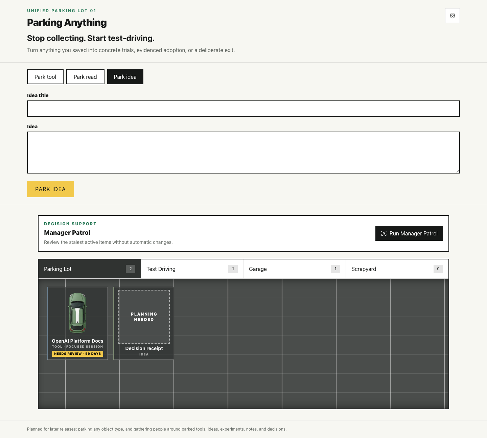
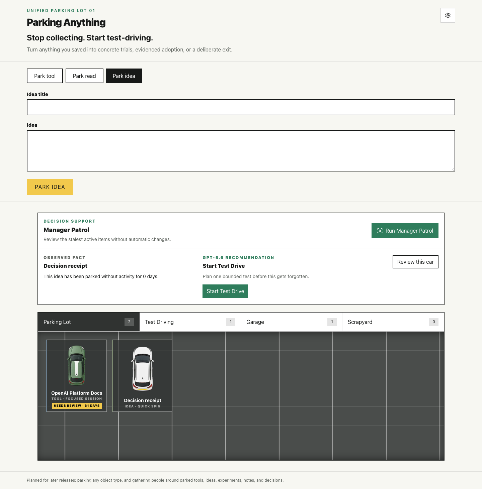

# Parking Anything

**[Live demo](https://parking-anything.vercel.app)** · **Built for OpenAI Build Week with Codex and GPT-5.6**

Parking Anything is a Next.js app that turns saved tools and ideas into testable decisions. Park something worth remembering, plan a first test, take it for a Test Drive, then preserve the result in the Garage or record a deliberate exit in the Scrapyard.

> Release status: the live demo currently serves the stable v0.4 baseline. The v0.5 unified-Parkable release is verified in a protected Preview and awaits explicit production approval.



## Why it exists

Bookmarks and fleeting ideas are easy to collect and hard to evaluate. Most tools optimize for saving more; Parking Anything adds a visible lifecycle that asks what deserves attention, what earned adoption, and what should leave.

## How v0.5 works

1. **Park tool** — Paste a public HTTP(S) URL. GPT-5.6 returns a structured test ticket with a summary, estimated effort tier, usefulness hypothesis, and first task.
2. **Park idea** — Capture a title and idea description without calling AI. The Idea enters the same Parking Lot as a first-class record.
3. **Plan and Test Drive** — An Idea needs an effort tier and concrete first test task before Test Drive. Planning updates the same record immediately.
4. **Garage or Scrapyard** — Garage requires a note or HTTP(S) Result URL. Tow Away requires a final decision reason. Either kind can reach either terminal history state.
5. **Manager Patrol** — Review up to three stale active Parkables. Deterministic **Observed Fact** text remains separate from a **GPT-5.6 Recommendation** or **Deterministic fallback**.

`Park whatever · Future` and `Gather · Future` are genuinely disabled controls. They show where the product can expand without pretending unsupported behavior exists.



## What GPT-5.6 does

- `gpt-5.6-luna` analyzes submitted Tool URLs through the OpenAI Responses API with Structured Outputs. If readable page text cannot be fetched, the response and UI visibly report URL-only analysis.
- `gpt-5.6-terra` produces judgment-sensitive Manager Patrol recommendations from a bounded mixed-kind candidate list.
- The model never owns IDs, timestamps, status, lifecycle transitions, evidence rules, activity age, candidate order, or fallback provenance.
- Patrol receives only candidate ID, kind, bounded title, optional effort tier, active status, and complete days since activity. Idea text, summaries, notes, hypotheses, Tool and Result URLs, decision reasons, the storage envelope, and unselected records remain local.

## What Codex built

This project was developed for OpenAI Build Week in a primary Codex task using a specification-first, TDD workflow. Codex implemented the strict domain model and migration, deterministic lifecycle, local persistence, OpenAI integrations, SSRF and quota boundaries, accessible UI, automated tests, visual QA, documentation, and deployment workflow.

GPT-5.6 provides runtime product intelligence; it did not build the application or own deterministic product facts. See the [build log](docs/build-log.md), [QA checklist](docs/qa-checklist.md), and [judge demo script](docs/demo-script.md) for observed evidence.

## Run locally

Prerequisites: Node.js 20.9 or newer and npm.

```bash
npm install
cp .env.example .env.local
npm run dev
```

Enter server-side values directly in `.env.local`; never place them in client code or commits. Then open [http://localhost:3000](http://localhost:3000).

Manual Idea capture, deterministic lifecycle actions, local fixtures, and reset work without OpenAI or Redis. Configure the server-side variables below to use live Tool analysis and Manager Patrol.

## Environment

| Variable | Required | Purpose |
| --- | --- | --- |
| `OPENAI_API_KEY` | Live AI | Server-only OpenAI event credential. |
| `OPENAI_ANALYZE_MODEL` | Optional | URL-analysis model; defaults to `gpt-5.6-luna`. |
| `OPENAI_PATROL_MODEL` | Optional | Patrol model; defaults to `gpt-5.6-terra`. |
| `UPSTASH_REDIS_REST_URL` | Production AI | Shared Upstash Redis REST endpoint for quotas. |
| `UPSTASH_REDIS_REST_TOKEN` | Production AI | Server-only Upstash Redis REST token. |
| `RATE_LIMIT_HASH_SECRET` | Production AI | Secret used to HMAC caller identities before quota keys are created. |
| `DEMO_API_ENABLED` | Optional | Defaults enabled; set to `false` to disable both public model routes. |
| `RATE_LIMIT_IP_MAX` | Optional | Per-caller request maximum; defaults to `10`. |
| `RATE_LIMIT_IP_WINDOW_SECONDS` | Optional | Per-caller window in seconds; defaults to `600`. |
| `RATE_LIMIT_GLOBAL_DAILY_MAX` | Optional | Shared daily ceiling; defaults to `300`. |

Production fails closed when required Upstash or hashing configuration is absent. Use a `RATE_LIMIT_HASH_SECRET` unrelated to the OpenAI key.

## One data model and lifecycle

`Park tool` and `Park idea` are capture adapters over one strict `ParkingItem` union:

- `kind: "ai_tool"` owns URL-analysis fields.
- `kind: "idea"` owns manual Idea text and optional planning while parked or scrapped.
- Both variants share `parked -> test_driving -> garaged` and `parked | test_driving -> scrapped` transitions.
- Garaged and scrapped records are terminal and read-only.
- There is no promotion, duplicate experiment, Idea waiting bay, separate lifecycle, or record deletion.

The effort tiers remain `quick_spin`, `focused_session`, and `weekend_project`. Shared result evidence uses `resultUrl`, so non-code Parkables are not forced into repository terminology.

## Local storage and migration

The browser is the only persistence layer: there is no account, server database, cross-device synchronization, or sharing.

- Fresh browsers receive the exact three stable Tool fixtures in `parking-anything:v2`.
- If v2 is absent, one strict `parking-anything:v1` envelope is parsed, converted, validated as a complete v2 envelope, and written once. The v1 key remains untouched.
- A present v2 key is authoritative. Malformed v2 data shows reset guidance and never falls back to v1.
- Reset restores exactly the three fixtures and removes locally added Parkables from v2.

v1 and v2 are not synchronized. Rolling back to the recorded v0.4 commit preserves untouched v1 data, while v0.5-only v2 edits remain dormant. Separately edited histories are not merged.

## Verification

```bash
npm run lint
npm test
npm run test:e2e
npm run build
```

The verified v0.5 gate passes 213 unit tests and 25 applicable Playwright tests across desktop Chromium and Mobile Safari. Twenty-seven inspected v0.5 screenshots cover nine states at 1440x900, 1024x768, and 390x844 under [`docs/qa-screenshots/`](docs/qa-screenshots/); the original v0.4 baselines remain preserved.

## Security and reliability boundaries

- OpenAI and Upstash secrets are read only by server modules.
- Public-page fetching accepts only HTTP(S), rejects credentials and non-public literal or resolved IP ranges, revalidates redirects, and bounds redirects, time, bytes, content type, and extracted text.
- Request JSON is bounded to 8 KB before parsing.
- Both model routes share per-caller and global quotas. Caller IPs are HMAC-derived before quota storage; application code does not use raw IPs as Redis keys.
- Production quota misconfiguration and backend errors fail closed with fixed responses.
- `DEMO_API_ENABLED=false` is a server-side kill switch; the seeded deterministic lifecycle remains available.
- Strict schemas keep model and server output separate from client-owned IDs, timestamps, status, evidence, and transitions.

## Known tradeoffs and future scope

- Persistence is browser-local and single-user.
- Readable-content failures may fall back to visibly labeled URL-only Tool analysis.
- Live AI may be unavailable because of provider errors, configuration, the kill switch, or the shared demo cap.
- Manager Patrol is an on-demand product persona, not an authenticated administrator.
- Accounts, permissions, backend administration, notifications, Gather collaboration, and additional Parkable kinds remain future work.

## License

[MIT](LICENSE)
